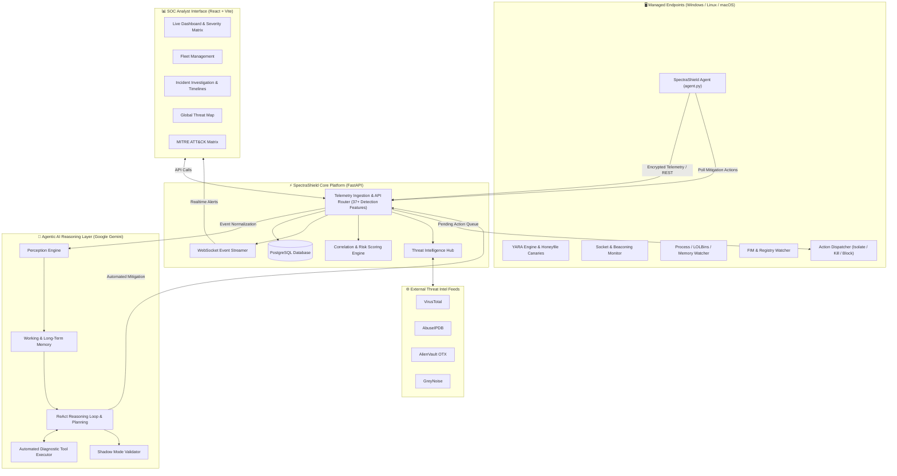

# SpectraShield 🛡️

> **Next-Generation Endpoint Detection & Response (EDR) Platform with Autonomous Agentic AI Reasoning**

[](https://www.python.org/)
[](https://fastapi.tiangolo.com/)
[](https://reactjs.org/)
[](https://vitejs.dev/)
[](https://www.postgresql.org/)
[](https://deepmind.google/technologies/gemini/)
[](https://attack.mitre.org/)
[]()
[]()

---

## 📌 Executive Summary

**SpectraShield** is an enterprise-grade, full-stack **Endpoint Detection & Response (EDR)** and **Security Operations (SOC)** management platform. It pairs lightweight, cross-platform endpoint surveillance agents with a high-throughput **FastAPI** telemetry ingestion engine, a multi-feed **Threat Intelligence Hub**, and an **Autonomous Agentic AI Reasoning Engine** powered by **Google Gemini**.

SpectraShield bridges the gap between raw low-level endpoint telemetry and actionable SOC operations: detecting evasive fileless malware, Living-off-the-Land Binaries (LOLBins), C2 beaconing, credential theft, and ransomware early in the attack chain, followed by automated or human-in-the-loop remediation.

---

## 🚀 Key Highlights & Architectural Innovations



### 1. 🧠 Agentic AI Reasoning Layer (Google Gemini)
- **ReAct (Reasoning + Acting) Autonomous Loop**: Employs an iterative LLM loop that evaluates incoming high-risk signals, formulates hypotheses, executes diagnostic tools, and renders structured incident verdicts.
- **Diagnostic Tool Calling**: The reasoning engine autonomously invokes tools including threat intel lookups, behavioral baselining, historical anomaly detection, and auto-response dispatch.
- **Hierarchical Memory**: Utilizes an in-memory sliding window **Working Memory** buffer for active agent telemetry paired with persistent **Long-Term Investigation Memory**.
- **Shadow Mode Validation**: Dual-track decision architecture allowing AI-generated verdicts to run in parallel with legacy rule-based engines for safety and calibration before direct action execution.
- **Automated Planning Engine**: Decomposes complex multi-stage attacks into multi-step investigative plans with confidence scoring.

### 2. 🛡️ Deep Endpoint Telemetry & 37+ Detection Modules
- **Fileless & Memory Attack Detection**: Audits memory injections, reflective DLLs, and suspicious process anomalies.
- **LOLBins Surveillance**: Out-of-the-box detection for weaponized binaries (`powershell.exe`, `certutil.exe`, `mshta.exe`, `regsvr32.exe`, `rundll32.exe`, `wmic.exe`, `cscript.exe`, `msiexec.exe`, etc.).
- **Anti-Ransomware Honeyfile Canaries**: Automatically deploys and inspects tripwire canary files in sensitive directories for zero-day encryption alerts.
- **C2 Beaconing Detection**: Evaluates connection frequencies, interval variance, and jitter algorithms (`min_connections`, `beaconing_max_jitter`, `beaconing_window_seconds`).
- **Credential Dumping Interception**: Detects LSASS memory access, Mimikatz invocations, and SAM registry dumping.
- **File Integrity Monitoring (FIM)**: Real-time file system monitoring using `watchdog`.
- **Registry & Persistence Watcher**: Tracks Windows Run/RunOnce keys, Scheduled Tasks, Startup folders, and Service creation.
- **Host Firewall & Web/DNS Filtering**: Inspects DNS resolutions, blocks known malicious domains, and configures host firewall rules.
- **YARA Rule Engine**: Integrates `yara-python` with compiled rule sets for continuous signature-based artifact scanning.

### 3. 🌐 Centralized Threat Intelligence Hub
- Concurrent multi-provider queries against:
  - **VirusTotal** (Hash, URL, IP, Domain)
  - **AbuseIPDB** (IP reputation and abuse confidence scoring)
  - **AlienVault OTX** (Threat pulses and indicator correlation)
  - **GreyNoise** (Internet-wide scanner filtering and benign actor noise reduction)
- **Offline Mode Fallback**: Caches indicators into a local offline threat database for air-gapped environments or API quota exhaustion.

### 4. 🎯 MITRE ATT&CK® Native Alignment
- Automatic mapping of detections and alert sequences against the MITRE ATT&CK enterprise matrix across 14 Tactics and sub-techniques (T1566, T1059, T1055, T1547, T1068, T1003, T1046, T1021, etc.).

### 5. ⚡ Automated & Orchestrated Incident Response
- Immediate automated response execution based on configurable policy thresholds:
  - `host_isolate`: Network isolation of compromised host while keeping agent C2 link active.
  - `process_terminate`: Terminating malicious processes by PID.
  - `network_block`: Blocking outbound/inbound communication to threat IPs.
  - `quarantine_file`: Isolating suspicious files into secure storage.
  - `dns_block`: Local domain sinkholing.
  - `firewall_rule`: Dynamic host firewall rule injection.

### 6. 📊 Modern Security Operations Dashboard
- Built with **React 18** and **Vite** using a custom dark-mode design system.
- Real-time alerts streaming over **WebSockets**.
- Live Agent Fleet Management and Agent Registration/Claiming.
- Interactive Alert Details Drawer with Process Tree visualization, MITRE tactics badges, and Investigation Timelines.
- Interactive Geographic Threat Map.

---

## 📂 Repository Directory Structure

```plaintext
SpectraShield/
├── .env                                  # Root environment variables
├── .env.example                          # Example environment configuration
├── backend/
│   ├── .env.example                      # Backend-specific environment template
│   ├── Dockerfile                        # Container recipe for backend
│   ├── docker-compose.yml                # Multi-service stack (Postgres + Backend + Frontend)
│   ├── requirements.txt                  # Backend Python dependencies
│   ├── agent_requirements.txt            # Lightweight endpoint agent dependencies
│   ├── agent_config.yaml                 # Agent configuration (intervals, directories, toggles)
│   ├── agent.py                          # Cross-platform Endpoint Agent main script
│   ├── main.py                           # FastAPI application entry point & router mounting
│   ├── config.py                         # Centralized configuration & environment loader
│   ├── pyinstaller.spec                  # PyInstaller spec for backend bundle
│   ├── agent_pyinstaller.spec            # PyInstaller spec for standalone agent binary
│   │
│   ├── agent_lib/                        # Endpoint Agent monitoring libraries
│   │   ├── action_dispatcher.py          # Executes host containment actions (isolate, kill, etc.)
│   │   ├── beaconing.py                  # C2 beaconing analysis engine
│   │   ├── behavioral.py                 # Process and command-line behavioral heuristics
│   │   ├── file_monitor.py               # Watchdog-based File Integrity Monitor
│   │   ├── network_monitor.py            # Socket and network connection inspector
│   │   ├── persistence_monitor.py        # Registry, service, and scheduled task auditor
│   │   ├── ransomware_canary.py          # Honeyfile canary deployer & tripwire monitor
│   │   ├── yara_scanner.py               # YARA signature scanning engine
│   │   └── ...                           # Exploit mitigation, hosts monitor, timeline, etc.
│   │
│   ├── authentication/                   # JWT & agent authorization mechanisms
│   ├── core/
│   │   ├── logging.py                    # Structured JSON logging
│   │   └── reasoning/                    # Agentic AI Engine (Google Gemini)
│   │       ├── reasoning_engine.py       # ReAct reasoning loop & verdict synthesis
│   │       ├── planning_engine.py        # Multi-step investigation planning
│   │       ├── perception.py             # Event normalization & context injection
│   │       ├── working_memory.py         # Ephemeral memory buffer for agents
│   │       ├── long_term_memory.py       # Persistent investigation state
│   │       ├── llm_client.py             # Gemini API wrapper with structured JSON output
│   │       └── tools/                    # Tool definitions for LLM invocation
│   │
│   ├── db/                               # SQLAlchemy database base, engine, and init lifespan
│   ├── detector/                         # Backend detection heuristics & LOLBins patterns
│   ├── models/                           # SQLAlchemy ORM models (Agent, Alert, Events, Reasoning)
│   ├── routers/                          # FastAPI route handlers (/api/alerts, /api/agents, etc.)
│   ├── schemas/                          # Pydantic validation schemas
│   ├── services/                         # Core platform services (Threat Intel, Risk Scoring, etc.)
│   └── yara_rules/                       # Compiled & raw YARA threat rules
│
└── frontend/
    ├── package.json                      # Frontend dependencies & scripts
    ├── vite.config.js                    # Vite build configuration
    ├── index.html                        # HTML single-page entry point
    └── src/
        ├── main.jsx                      # React root rendering
        ├── App2.jsx                      # SOC Management Console & Navigation
        └── App3.css                      # Custom cyber-themed design system
```

---

## ⚙️ Prerequisites

Ensure your host environment meets the following minimum prerequisites:

- **Python**: Version 3.10 or higher
- **Node.js**: Version 18 or higher & npm
- **PostgreSQL**: Version 14 or higher (or use Docker)
- **Git**: For source versioning
- **C/C++ Build Tools** *(Optional, recommended for Windows YARA compilation)*

---

## 🛠️ Quickstart Installation

### Option 1: Full-Stack Docker Compose (Recommended)

Run the entire platform (PostgreSQL database, FastAPI backend, and React frontend) with a single command:

1. **Clone the repository**:
   ```bash
   git clone https://github.com/AaronG19/SpectraShield-.git
   cd SpectraShield
   ```

2. **Configure environment variables**:
   ```bash
   cp backend/.env.example .env
   ```
   *Edit `.env` to supply your `SECRET_KEY`, `GEMINI_API_KEY`, and optional threat intel API keys.*

3. **Launch the stack**:
   ```bash
   docker-compose -f backend/docker-compose.yml up --build
   ```

4. **Access the platform**:
   - **SOC Dashboard**: [http://localhost:5173](http://localhost:5173)
   - **FastAPI REST Docs**: [http://localhost:8080/docs](http://localhost:8080/docs)
   - **PostgreSQL**: `localhost:5432`

---

### Option 2: Manual Local Setup

#### Step 1: PostgreSQL Setup
Create a PostgreSQL database named `agent_security`:
```sql
CREATE DATABASE agent_security;
```

#### Step 2: Backend Setup
1. Open a terminal in the `backend/` directory:
   ```bash
   cd backend
   ```
2. Create and activate a virtual environment:
   ```bash
   # Windows (PowerShell)
   python -m venv venv
   .\venv\Scripts\Activate.ps1

   # Linux / macOS
   python3 -m venv venv
   source venv/bin/activate
   ```
3. Install dependencies:
   ```bash
   pip install -r requirements.txt
   ```
4. Configure your `.env` in the project root or `backend/`:
   ```bash
   cp .env.example .env
   ```
5. Start the backend service:
   ```bash
   python main.py
   ```
   *The server runs at `http://localhost:8080` (Auto-creates all tables on startup).*

#### Step 3: Frontend Setup
1. Open a new terminal in `frontend/`:
   ```bash
   cd frontend
   ```
2. Install Node dependencies:
   ```bash
   npm install
   ```
3. Run the development server:
   ```bash
   npm run dev
   ```
   *The dashboard will be available at `http://localhost:5173`.*

---

## 💻 Deploying the Endpoint Agent

The SpectraShield Agent can be deployed to any Windows, Linux, or macOS target machine to continuously stream telemetry and enforce containment policies.

### Running from Source
1. Install the agent-specific dependencies on the target host:
   ```bash
   pip install -r backend/agent_requirements.txt
   ```
2. Check `backend/agent_config.yaml` to ensure `backend_url` points to your backend instance (e.g., `http://localhost:8080` or `http://your-edr-server:8080`).
3. Run the agent:
   ```bash
   python backend/agent.py
   ```
4. **Agent Registration & Claiming**:
   - On first launch, the agent generates an `agent.id` and requests a registration token.
   - In the SOC Dashboard (`/agents`), click **Claim Agent**, enter the agent hostname and one-time token to bind the agent to your analyst account.

### Compiling Standalone Executable (PyInstaller)
To package the agent into a single binary for distribution across endpoints without requiring Python installed:
```bash
cd backend
pyinstaller agent_pyinstaller.spec
```
The compiled standalone executable will be generated in `backend/dist/`.

---

## 🔧 Configuration Reference (`.env`)

| Variable | Default | Description |
| :--- | :--- | :--- |
| `SECRET_KEY` | *Required* | 64-character random string for signing JWT tokens |
| `DATABASE_URL` | `postgresql://...` | PostgreSQL connection string |
| `ENV` | `development` | Set to `production` in production deployments |
| `LOG_LEVEL` | `INFO` | Logging level (`DEBUG`, `INFO`, `WARNING`, `ERROR`) |
| `CORS_ORIGINS` | `["http://localhost:5173"]` | Allowed CORS origins for the frontend UI |
| **Threat Intelligence** | | |
| `VT_API_KEY` | `""` | VirusTotal v3 API Key |
| `ABUSEIPDB_API_KEY` | `""` | AbuseIPDB API Key |
| `OTX_API_KEY` | `""` | AlienVault OTX API Key |
| `GREYNOISE_API_KEY` | `""` | GreyNoise Community or Enterprise API Key |
| **Agentic AI & LLM** | | |
| `GEMINI_API_KEY` | `""` | Google Gemini API Key |
| `LLM_MODEL` | `gemini-1.5-flash` | Gemini model ID (`gemini-1.5-flash`, `gemini-1.5-pro`) |
| `AGENTIC_LLM_ENABLED` | `true` | Master toggle for Gemini AI queries |
| `AGENTIC_MODE` | `true` | Enables the full Agentic Reasoning subsystem |
| `AGENTIC_SHADOW_MODE` | `false` | When `true`, AI verdicts are recorded without auto-triggering actions |
| `AGENTIC_SEVERITY` | `true` | LLM-assisted severity scoring |
| `AGENTIC_CORRELATION` | `true` | LLM-assisted multi-event incident correlation |
| `AGENTIC_RESPONSE` | `true` | Allows LLM to recommend and trigger automated response actions |
| **Risk & Behavioral** | | |
| `BEHAVIORAL_ANALYSIS_ENABLED` | `true` | Enables real-time heuristic rule analysis |
| `AUTO_RESPONSE_ENABLED` | `true` | Enables automated containment responses |
| `RISK_SCORE_THRESHOLD_LOW` | `20` | Threshold for Low severity classification |
| `RISK_SCORE_THRESHOLD_MEDIUM`| `40` | Threshold for Medium severity classification |
| `RISK_SCORE_THRESHOLD_HIGH` | `65` | Threshold for High severity classification |
| `RISK_SCORE_THRESHOLD_CRITICAL`| `85` | Threshold for Critical severity classification |
| `CORRELATION_TIME_WINDOW` | `3600` | Event correlation window in seconds |

---

## 🧪 Testing & Verification

SpectraShield includes automated unit tests for its reasoning pipeline and mock event loops.

Run the Agentic Reasoning test suite:
```bash
python backend/test_agentic_llm.py
```

Expected output:
```plaintext
Ran 2 tests in 0.831s
OK
```

---

## 📡 API & WebSocket Overview

All REST API routes are prefixed under `/api`:

- **Auth**: `/api/auth/register`, `/api/auth/login`, `/api/auth/claim-agent`, `/api/auth/me`
- **Dashboard**: `/api/dashboard/stats`, `/api/dashboard/trends`
- **Agents**: `/api/agents`, `/api/agents/{id}`, `/api/agents/{id}/actions`
- **Alerts**: `/api/alerts`, `/api/alerts/{id}`, `/api/alerts/{id}/resolve`
- **Detections**: 37 dedicated feature telemetry ingestion routes (`/api/detections/...`)
- **Reasoning**: `/api/reasoning/tools`, `/api/reasoning/memory`, `/api/reasoning/shadow-report`
- **Policies**: `/api/policies`
- **Threat Map**: `/api/threats/feed`, `/api/threats/stats`
- **WebSockets**: `/ws/alerts`, `/ws/telemetry` for live event push

Interactive documentation is available via Swagger UI at `/docs` or ReDoc at `/redoc`.

---

## 🔒 Security Best Practices

1. **Production Secret Keys**: Always set a cryptographically secure 64-character `SECRET_KEY` in production environments.
2. **API Key Confidentiality**: Never commit `.env` containing live VirusTotal or Gemini API keys to public source control.
3. **Database Security**: Enforce restrictive firewall access on PostgreSQL port `5432`.
4. **Least Privilege Agent Execution**: The endpoint agent requires administrative privileges on Windows/Linux for process termination and host firewall rules, but file monitoring and beaconing detection function in standard user contexts.

---

## 📄 License & Disclaimer

This project is developed as part of an Advanced Cybersecurity Engineering Internship project. All rights reserved.

> **Disclaimer**: SpectraShield is intended for authorized security monitoring and defensive operations. Ensure proper authorization before deploying agents to endpoints or scanning network infrastructure.
